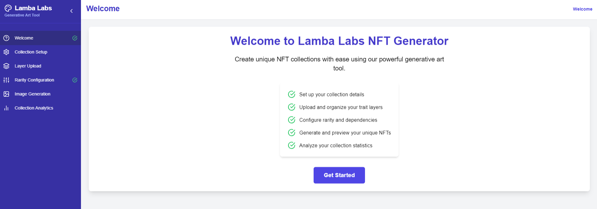
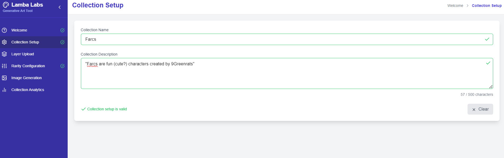
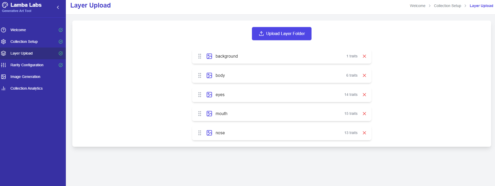
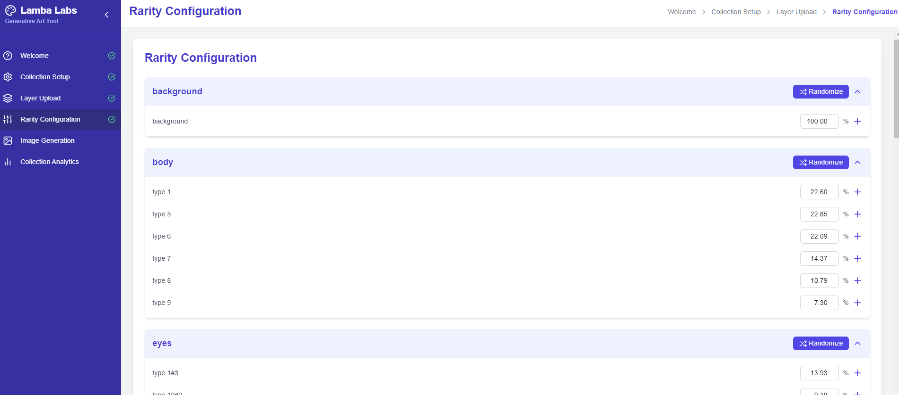
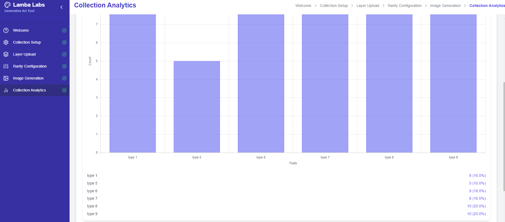

# Lamba Labs 4.0 Generative Art Tool

Lamba Labs 4.0 Generative Art Tool is a powerful and user-friendly application for creating unique NFT PFP collections. This tool allows artists and creators to easily generate thousands of unique images by combining different trait layers with customizable rarity settings.

## Features

- **Intuitive UI**: A step-by-step interface guides you through the entire NFT creation process. (See [Welcome Screen](#welcome-screen))
- **Collection Setup**: Define your collection's name and description with real-time validation. (See [Collection Setup](#collection-setup))
- **Layer Management**: 
  - Easy upload and organization of multiple layers and traits.
  - Drag-and-drop interface for intuitive layer and trait ordering.
  - Visual preview of uploaded trait images.
  (See [Layer Management](#layer-management))
- **Advanced Rarity Configuration**: 
  - Set custom rarity levels for each trait within a layer.
  - Visual representation of rarity distribution with pie charts.
  - Bulk rarity setting and normalization features.
  (See [Rarity Configuration](#rarity-configuration))
- **Image Generation**: Generate thousands of unique images with a single click. (See [Image Generation](#image-generation))
- **Real-time Preview**: View thumbnails of generated images as they're created. (See [Image Generation](#image-generation))
- **Collection Analytics**: Analyze trait distribution and rarity scores for your generated collection. (See [Collection Analytics](#collection-analytics))
- **Responsive Design**: Collapsible sidebar for better use of screen space. (See [Responsive Design](#responsive-design))

## Screenshots

### Welcome Screen

*The welcome screen introduces users to the Lamba Labs 4.0 Generative Art Tool.*

### Collection Setup

*Users can easily set up their collection with a name and description.*

### Layer Management

*The layer management interface allows for easy organization and preview of traits.*

### Rarity Configuration

*Advanced rarity settings can be configured for each trait with visual representations.*

### Image Generation

*The image generation process with real-time previews of created images.*

### Collection Analytics

*Detailed analytics provide insights into trait distribution and rarity scores.*


## Getting Started

1. Clone this repository to your local machine:
   ```
   git clone https://github.com/9GreenRats/LambaLabs.git
   ```
2. Navigate to the project directory:
   ```
   cd lambalabs
   ```
3. Install the required dependencies:
   ```
   npm install
   ```
4. Start the development server:
   ```
   npm run dev:lambalabs
   ```
5. Open your browser and navigate to `http://localhost:4000` (or the port specified in your console).

## How to Use

1. **Welcome**: Start by clicking the "Get Started" button on the welcome screen.
2. **Collection Setup**: Enter your collection name and description.
3. **Layer Upload**: Add layers and upload trait images for each layer.
4. **Rarity Configuration**: Set rarity levels for each trait using sliders or input fields.
5. **Image Generation**: Generate your unique images and preview them in real-time.
6. **Collection Analytics**: View distribution and rarity information for your generated collection.

## Contributing

We welcome contributions to improve the Lamba Labs 4.0 Generative Art Tool. Please feel free to submit issues, feature requests, or pull requests.

## License

This project is licensed under the MIT License. See the [LICENSE](LICENSE) file for details.

## Acknowledgments

- This project was created by [9GreenRats](https://x.com/9GreenRats), initially for personal use, as all other available tools were CLI-based. The goal was to create an easy-to-use tool with comprehensive functionalities for generative NFT PFP collection creation.
- This project uses [React](https://reactjs.org/) and [TypeScript](https://www.typescriptlang.org/).
- UI components are built with [Material-UI](https://material-ui.com/).
- Drag and drop functionality is implemented using [react-beautiful-dnd](https://github.com/atlassian/react-beautiful-dnd).
- Charts are created using [react-minimal-pie-chart](https://www.npmjs.com/package/react-minimal-pie-chart).
